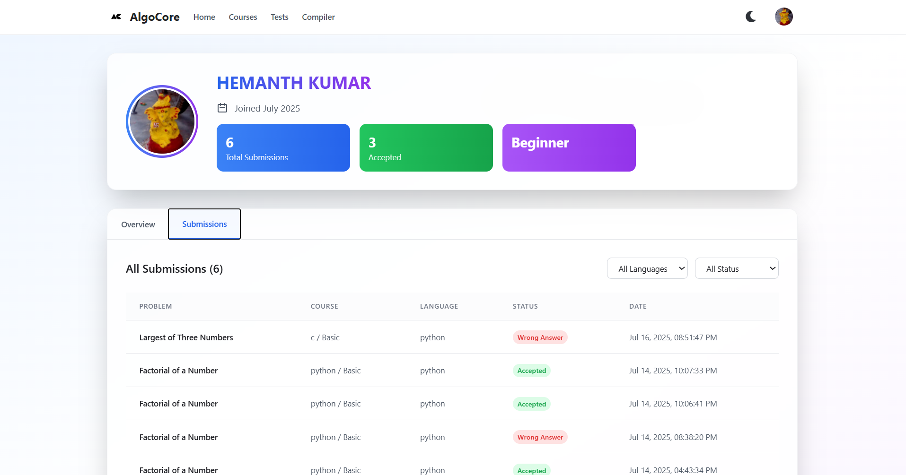

# 📦 AlgoCore

A modern and responsive web application built using **React**. This project demonstrates component-based architecture, reusable UI elements, and best practices in front-end development.

## 🚀 Demo

[Live Demo](https://hemanthkumarannam.github.io/AlgoCore2)

## 📸 Screenshots

| Home Page | Dashboard |
|-----------|-----------|
|  |  |

## 🧰 Tech Stack

- ⚛️ React
- 🧱 HTML5 + CSS3
- 🌀 Tailwind CSS


## ✅ Features

- 🔥 Responsive design
- 🔍 Search and filter functionality
- 🔐 Authentication (Login/Register)
- 🎨 Theming support (Light/Dark mode)
- 🧭 Routing with React Router
- 📦 API integration
- 🧪 Unit/Component Testing

## 🛠️ Getting Started

### Prerequisites

- Node.js (>= 14.x)
- npm or yarn


### File Struture

- your-react-app/
- ├── public/
- ├── src/
- │   ├── assets/
- │   ├── components/
- │   ├── pages/
- │   ├── services/
- │   ├── App.js
- │   └── index.js
- ├── .env
- ├── .gitignore
- ├── package.json
- └── README.md


### Installation

```bash
git clone https://github.com/hemanthkumarannam/AlgoCore2.git
cd your-react-app
npm install
# or
yarn install

